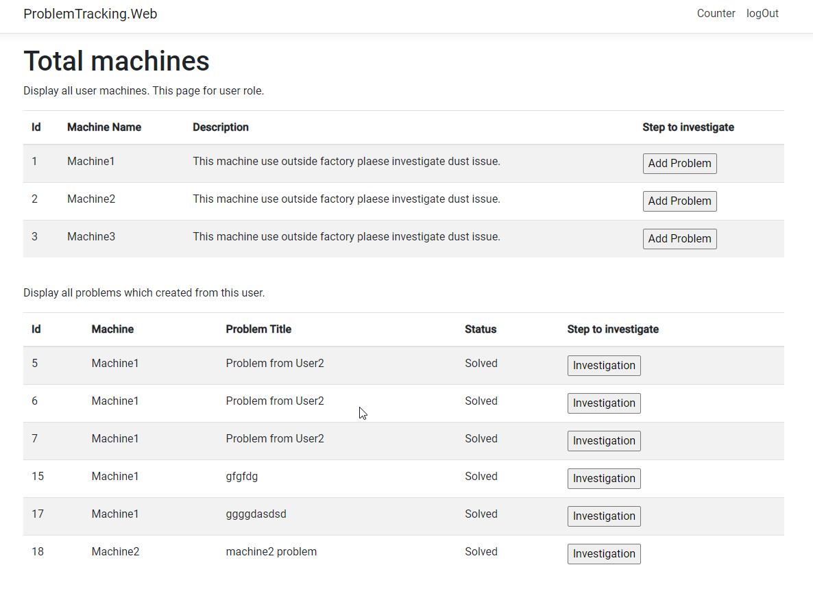
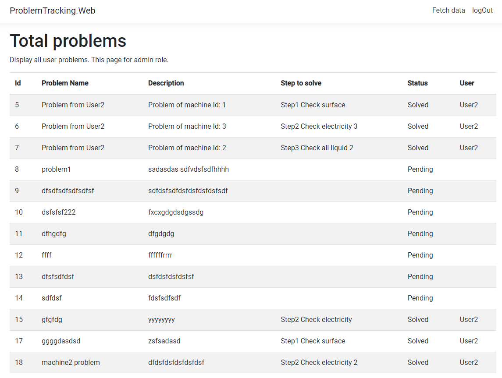

# ProblemTracking
This project is just demo for full stack with angular

# Tool
nodejs version: v14.3.0

Visual studio 2019 or 2022

.Net core 5.0

Nswag studio version 13.17.0.0

# How to install 
1. Change **DBConnectionString** in **appsettings.json** of **ProblemTracking.Web project** to be your DB configulation.
2. Browser to the path => "ProblemTracking.Web\ClientApp" open command prompt and run **npm install** (please use nodejs version v14.3.0 if possible)
3. Run web application(This step the program run migration scripts).
4. Open Nswag studio open file "api.client.swagger.nswag" at "ProblemTracking.Web\ClientApp\src\app\shared\services".
5. Normally the program automately refresh the page if not manually reflesh browser again.
6. if login page appear use deme users below to login  
    user: user1 
    
    password: 12345
    
    role: Admin
    
     
    user: user2
    
    password: 12345
    
    role: User
    
# Overall
This is the demo program to show how to implement backend(c#) and frontend(Angular) work together. I create this project for problem solving of machine. This system has 2 role Admin and User roles.
### User role
Add the problem and how to solve the problem.

### Admin role
View the report how many problems and the status of problems can solve or not.

# How it work
This project contains 3 project 
## ProblemTracking.Entity
This project use to interact with database. It contain entities and migration script.

## ProblemTracking.Repository
This project use to manipulate the entity such as query, insert data. It is the middle of web project and entity project. It contaian of repository interface and unit of work class.

## ProblemTracking.Web
This project is the web project which interact with user. It contain web api and Angular component.

