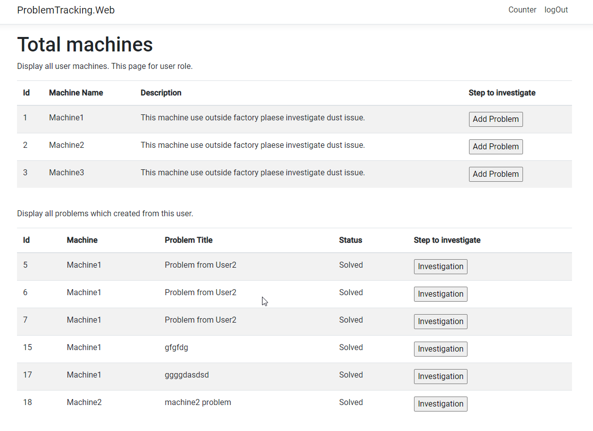
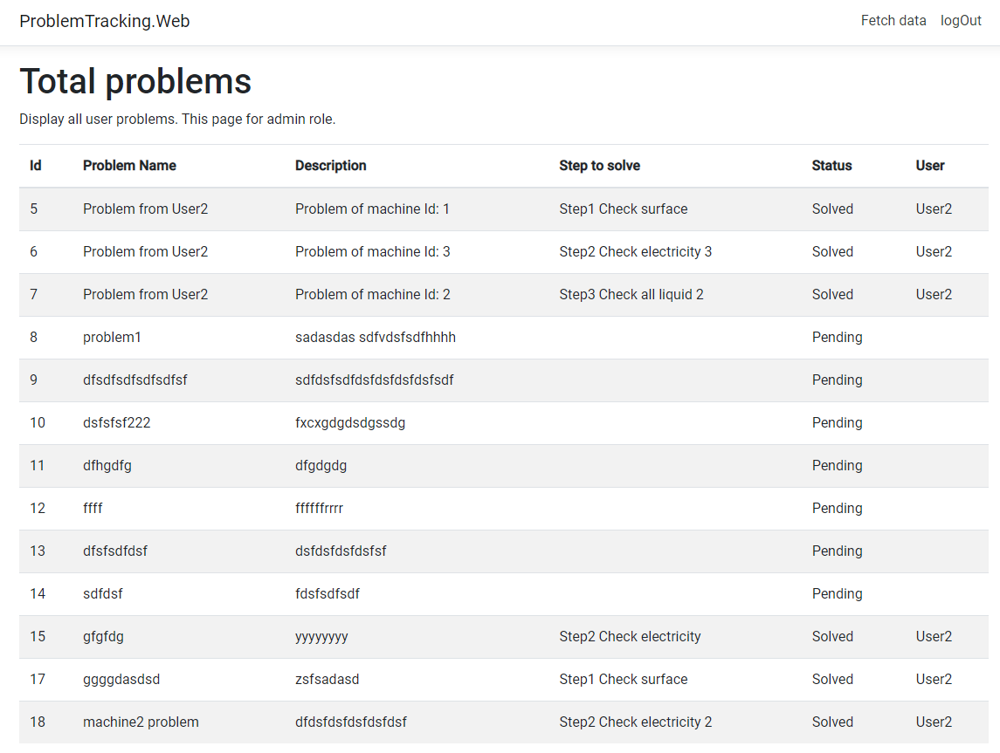

# Problem Tracking

A full-stack demo application for tracking and resolving recurring machine problems on a factory floor — built with **ASP.NET Core 10** and **Angular 19**, secured with **JWT** and role-based authorization.


---

## 📖 What it does

Operators record machines that break down, walk through a predefined investigation checklist, and mark which step resolved the issue. Supervisors get a roll-up view of every problem and its outcome so the most failure-prone machines and the most effective fixes are visible at a glance.

| Role  | Capabilities                                                          |
| ----- | --------------------------------------------------------------------- |
| User  | Report a problem, run investigation steps, mark the resolving step    |
| Admin | View all problems with their status and which step solved each one    |

### Screenshots

| User dashboard                                                             | Admin dashboard                                                              |
| -------------------------------------------------------------------------- | ---------------------------------------------------------------------------- |
|  |  |

---

## 🏛️ Architecture

```
┌────────────────────────────────────────────────────────────────┐
│  Angular 19 SPA (ClientApp/)                                   │
│    • Reactive Forms · Material 19 · RxJS 7                     │
│    • Generated TypeScript client (NSwag)                       │
└──────────────┬─────────────────────────────────────────────────┘
               │ JWT Bearer · /api/*
┌──────────────▼─────────────────────────────────────────────────┐
│  ProblemTracking.Web (ASP.NET Core 10)                         │
│    • Controllers · Services · DTOs · NSwag OpenAPI             │
└──────────────┬─────────────────────────────────────────────────┘
               │
┌──────────────▼─────────────────────────────────────────────────┐
│  ProblemTracking.Repository                                    │
│    • Generic RepositoryBase<T> · Unit of Work                  │
└──────────────┬─────────────────────────────────────────────────┘
               │
┌──────────────▼─────────────────────────────────────────────────┐
│  ProblemTracking.Entity (EF Core 10)                           │
│    • DbContext · Entities · Migrations                         │
└────────────────────────────────────────────────────────────────┘
```

### Projects

| Project                       | Responsibility                                            |
| ----------------------------- | --------------------------------------------------------- |
| `ProblemTracking.Entity`      | EF Core entities, `ApplicationDbContext`, migrations      |
| `ProblemTracking.Repository`  | `RepositoryBase<T>`, `UnitOfWork`, repository interfaces  |
| `ProblemTracking.Web`         | Web API, DTOs, JWT auth, Angular client (`ClientApp/`)    |

---

## 🛠️ Tech Stack

**Backend**

- .NET 10 · ASP.NET Core minimal hosting
- Entity Framework Core 10 (SQL Server)
- JWT authentication (`Microsoft.AspNetCore.Authentication.JwtBearer`)
- Mapster (entity ↔ DTO mapping)
- NSwag (OpenAPI / Swagger UI + TypeScript client generation)

**Frontend**

- Angular 19 · TypeScript 5.6
- Angular Material 19 · Bootstrap 5
- RxJS 7 · Reactive Forms
- esbuild (Angular CLI application builder)

**Tooling**

- NSwag Studio 14.7 (regenerates the typed API client from `swagger.json`)
- SQL Server / SQL Express

---

## 🚀 Getting Started

### Prerequisites

- [.NET 10 SDK](https://dotnet.microsoft.com/download)
- [Node.js 20+](https://nodejs.org/)
- SQL Server (LocalDB / Express / Developer edition)
- (Optional) [NSwag Studio](https://github.com/RicoSuter/NSwag/wiki/NSwagStudio) — only needed if you change the API contract

### 1. Clone & configure

```bash
git clone https://github.com/<your-username>/ProblemTracking.git
cd ProblemTracking
```

Update the connection string in [`ProblemTracking.Web/appsettings.json`](./ProblemTracking.Web/appsettings.json):

```json
"ConnectionStrings": {
  "DBConnectionString": "Server=localhost\\sqlexpress;Database=ProblemTracking;Trusted_Connection=True;Encrypt=False;TrustServerCertificate=True"
}
```

> **Note on `TrustServerCertificate`**: `Microsoft.Data.SqlClient` 4.0+ enables TLS by default. Use `TrustServerCertificate=True` only for local development against self-signed certs. For production, install a trusted SQL Server certificate and remove this flag.

### 2. Install frontend dependencies

```bash
cd ProblemTracking.Web/ClientApp
npm install
cd ../..
```

### 3. Run

```bash
dotnet run --project ProblemTracking.Web
```

On first launch:
- EF Core runs pending migrations automatically
- A separate console window opens and starts the Angular dev server on port 4200
- ASP.NET Core proxies SPA requests to it; API calls hit the controllers directly

Open https://localhost:44367 (or the URL printed in the console).

### 4. (Optional) Regenerate the typed API client

After changing any controller signature:

```
Open ProblemTracking.Web/ClientApp/src/app/shared/services/api.client.swagger.nswag in NSwag Studio → Run
```

This refreshes `generated/api.client.generated.ts` against the live Swagger document.

---

## 👤 Demo Accounts

The database is seeded with two demo accounts:

| Username | Password | Role  |
| -------- | -------- | ----- |
| `user1`  | `12345`  | Admin |
| `user2`  | `12345`  | User  |

> ⚠️ **Demo only** — passwords are stored in plaintext for simplicity. See the [Known limitations](#-known-limitations) section.

---

## 🔌 API Overview

Once running, the OpenAPI document is at `/swagger/v1/swagger.json` and Swagger UI is at `/swagger`.

| Method | Endpoint                                | Auth         | Description                                  |
| ------ | --------------------------------------- | ------------ | -------------------------------------------- |
| POST   | `/api/Login/login`                      | Anonymous    | Returns a JWT for valid credentials          |
| GET    | `/api/Machine/getMachines`              | User         | Lists machines and their investigation steps |
| GET    | `/api/Problem/getAllProblems`           | Admin        | All problems with resolution status          |
| GET    | `/api/Problem/getProblemsByUser`        | User         | Problems reported by the current user        |
| POST   | `/api/Problem/addProblem`               | User         | Reports a new problem                        |
| POST   | `/api/Problem/addProblemInvestigate`    | User         | Records the step that solved a problem       |

---

## 📦 Project Highlights

- **Modern .NET 10 minimal hosting** — `Program.cs` configures everything; no `Startup.cs`
- **Auto-launched Angular dev server** — `Program.cs` spawns `ng serve` and proxies requests, so `F5` in Visual Studio is enough for full-stack debugging
- **End-to-end type safety** — server DTOs flow into the SPA via NSwag's TypeScript code generator
- **Migration-on-startup** — EF Core migrations apply automatically the first time the app runs
- **Multi-project clean architecture** — Entity / Repository / Web separation with clear seams

---

## 🐞 Known Limitations

This is a demo project, kept intentionally small. Items below are not bugs — they are deliberate trade-offs the production version should address:

- **Passwords stored as plaintext.** Production should hash with `BCrypt.Net-Next` or move to ASP.NET Core Identity.
- **JWT signing key in `appsettings.json`.** Should move to `dotnet user-secrets` (dev) and environment variables / Azure Key Vault (prod).
- **CORS allows any origin.** Lock down to known frontends in production.
- **`TrustServerCertificate=True` in the connection string** — see note above; replace with a real cert.
- **No automated tests.** Unit + integration coverage is on the roadmap.

---

## 📚 Migration Story (v1 → v2)

This repo was upgraded from the original .NET 5 / Angular 8 stack:

| Layer    | Before        | After          |
| -------- | ------------- | -------------- |
| .NET     | 5.0 + Startup | 10.0 + minimal hosting |
| EF Core  | 5.0.17        | 10.0           |
| NSwag    | 13.17         | 14.2           |
| Angular  | 8.2           | 19             |
| TypeScript | 3.5         | 5.6            |
| RxJS     | 6.6           | 7.8            |
| Bootstrap | 4.6          | 5.3            |
| Material | 8.2           | 19             |

Notable migration work:
- Merged `Startup.cs` into `Program.cs` (minimal hosting)
- Switched SPA integration from `UseAngularCliServer` (pattern-matched stdout, broken since Angular 17) to `UseProxyToSpaDevelopmentServer` with manual port readiness polling
- Removed deprecated `@nguniversal/*`, `protractor`, `tslint`, `node-sass`, `hammerjs`
- Adopted Angular 19's `standalone: false` declaration to keep the NgModule-based bootstrap

---

## 💡 What I Learned

A few breaking changes from this migration that aren't on the official guides — each one is something I actually hit and had to debug:

**1. Minimal hosting changes middleware order.** With the old `Startup.cs`, you put `UseEndpoints(...)` in a specific place and that's where endpoint dispatch ran. With minimal hosting, `app.MapControllerRoute(...)` only *registers* the route — the actual dispatch is auto-inserted at the **end** of the pipeline. So `app.UseSpa(...)` catches `/api/...` first and proxies it to Angular, which 404s. Fix: bring back an explicit `UseEndpoints { MapControllers(); MapControllerRoute(...); }` block before `UseSpa`.

**2. `UseAngularCliServer` is broken since Angular 17.** It detects "ng serve is ready" by regex-matching stdout for `"Angular Live Development Server is listening"`. Angular 17 switched to esbuild and prints `➜ Local: http://localhost:4200/` instead, so the regex never matches and a 120-second timeout fires. Fix: launch `npm start` myself and poll port 4200 with `TcpClient` to know when it's reachable.

**3. SQL Server connection strings need `Encrypt=False` for local dev.** `Microsoft.Data.SqlClient` 4.0+ (shipped with EF Core 7+) flipped the `Encrypt` default to `true`. The error *"The certificate chain was issued by an authority that is not trusted"* just means the local SQL Server uses a self-signed cert. Add `Encrypt=False;TrustServerCertificate=True` for dev; install a real cert for prod.

**4. NSwag 13 output doesn't compile under rxjs 7 + strict TypeScript.** The generated client uses `_observableOf<T[]>(null as any)` and `import * as moment from 'moment'`. Both worked under rxjs 6 / TS 3.5 but fail under rxjs 7 / TS 5.6 in strict mode. Hand-editing auto-generated files is a losing game — I added `// @ts-nocheck` and upgraded the `.nswag` config to v14 so future regenerations produce strict-compatible code.

**5. Angular 19 makes components `standalone: true` by default.** If you still use `NgModule.declarations`, the compiler throws *"Component X is standalone, and cannot be declared in an NgModule"*. Fix: add `standalone: false` to every `@Component` while gradually migrating to the standalone API.

**6. `Microsoft.AspNetCore.SpaServices.Extensions` is archived.** No .NET 10 release of the package — I'm using the .NET 9 version on .NET 10 because the API hasn't changed. For new projects, run `ng serve` as a separate process (with CORS) instead of relying on the integration.

**7. The Angular ecosystem changed more than Angular itself.** Upgrading .NET took ~30 minutes. Upgrading Angular took hours — not because Angular is harder, but because of everything around it: `tslint` → ESLint, `protractor` → gone, `node-sass` → `sass`, `@nguniversal/*` → `@angular/ssr`, Bootstrap 4 → 5 (jQuery dropped, class names renamed). Each is small, but together it's a project.

---

## 📄 License

MIT — feel free to use this as a learning reference or a starting point for your own projects.
